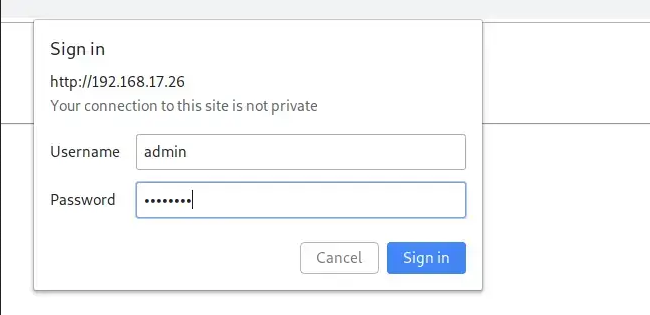

# 🐍 SVN_snake_installer

 

## This is a small script, which saves you ⏳ when setting up a svn server on your own.

* Open-Source
* Python
* subprocess
* os
* Debian/Ubuntu
* apache2

## How to get the software up and running ?

For now, I have not got any installer ready yet, but you can just clone the repo and run it yourself.

#  